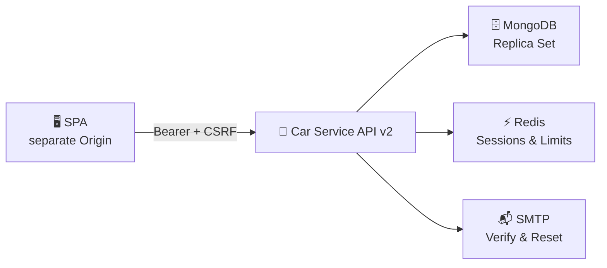

# 🚗 Car Service API

[](https://nodejs.org/)
[](docs/API-v2.md)
[](SECURITY.md)
[](LICENSE)

Eine sichere, mandantenfähige REST-API zur Verwaltung von Fahrzeugen und Wartungsereignissen. Die Anwendung ist auf eine getrennte SPA- und API-Origin, MongoDB Replica Sets, Redis und SMTP ausgelegt.

> [!IMPORTANT]
> Dies ist **API v2**. Die unsichere Alt-API wurde entfernt. Bestehende Clients müssen auf `/api/v2` migrieren.

## ✨ Sicherheitsprofil

| Bereich              | Umsetzung                                                                             |
| -------------------- | ------------------------------------------------------------------------------------- |
| 🔐 Anmeldung         | Kurzlebige Access-Tokens, rotierende und widerrufbare Refresh-Sessions                |
| 🛡️ Browser-Schutz    | HttpOnly/Secure Refresh-Cookie, CSRF-Token, exakte CORS-Allowlist                     |
| 👤 Datenschutz       | Eigentümerprüfung auf jeder Ressource, sichere Nutzer-DTOs, keine Hashes in Responses |
| 📬 Recovery          | Einmalige, gehashte E-Mail-Verifikations- und Passwort-Reset-Tokens                   |
| 🚦 Missbrauchsschutz | Redis-gestützte globale und Auth-Rate-Limits                                          |
| 🧱 Infrastruktur     | Helmet, Body-Limit, strukturierte redigierte Logs, Readiness-Endpunkt                 |

## 🏗️ Architektur



## 🚀 Schnellstart

| Voraussetzung | Version / Hinweis                         |
| ------------- | ----------------------------------------- |
| Node.js       | 22 LTS (`>=22.21.0 <25`)                  |
| MongoDB       | Replica Set erforderlich in Produktion    |
| Redis         | Pflicht für Sessionschutz und Rate Limits |
| SMTP          | Pflicht für Verifikation und Recovery     |

```bash
npm ci
cp .env.example .env
# .env mit echten Secret- und Infrastrukturwerten ausfüllen
npm run dev
```

`ACCESS_TOKEN_SECRET`, SMTP-Zugangsdaten und Datenbank-URLs gehören ausschließlich in einen Secret Manager oder eine nicht eingecheckte `.env`-Datei.

## ⚙️ Konfiguration

| Variable                      | Zweck                                             |
| ----------------------------- | ------------------------------------------------- |
| `MONGODB_URI`                 | MongoDB-Replica-Set-Verbindung                    |
| `REDIS_URL`                   | Zentraler Store für Rate Limits                   |
| `ACCESS_TOKEN_SECRET`         | Mindestens 32 zufällige Zeichen für Access-Tokens |
| `JWT_ISSUER` / `JWT_AUDIENCE` | Feste Token-Bindung an diese API und SPA          |
| `APP_ORIGIN` / `CORS_ORIGINS` | Exakte Frontend-Origin und E-Mail-Link-Ziel       |
| `SMTP_*`                      | Versand von Verifikations- und Reset-E-Mails      |
| `COOKIE_SECURE`               | In Produktion zwingend `true`                     |

Alle Variablen sind in [.env.example](.env.example) dokumentiert.

## 📡 API-Überblick

| Kategorie    | Endpunkte                                                                |
| ------------ | ------------------------------------------------------------------------ |
| 🔑 Auth      | `register`, `verify-email`, `login`, `refresh`, `logout`, Passwort-Reset |
| 👤 Konto     | `GET /users/me`, Passwortwechsel, vollständige Kontolöschung             |
| 🚗 Fahrzeuge | Eigene Fahrzeuge erstellen, lesen, ändern, löschen                       |
| 🧰 Wartung   | Kilometer-, TÜV-, Ölwechsel- und Service-Events pro Fahrzeug             |

Die vollständige Request-/Response-Dokumentation steht in [API v2](docs/API-v2.md). Schreibende Endpunkte akzeptieren nie eine `userId`; der Eigentümer stammt immer aus dem Access-Token.

## 🧪 Qualität und Sicherheit

```bash
npm run lint
npm run format:check
npm test
npm run audit:production
```

Die Integrationstests prüfen unter anderem Mandantentrennung, Hash-Redaktion, CSRF, Refresh-Rotation und die fachliche Regel gegen rückläufige Kilometerstände.

## 🔄 Migration von v1

Vor einem Release unbedingt Backup und Dry-Run ausführen:

```bash
npm run migrate:v2:dry-run
npm run migrate:v2
npm run migrate:v2 -- --send-emails
```

Die idempotente Migration überführt Fahrzeughistorien in skalierbare Events, entfernt Superpasswort-Hashes und erzwingt für Bestandskonten einen sicheren E-Mail-Reset. Der detaillierte Ablauf inklusive Rückfallpfad steht in [Migration v2](docs/MIGRATION-v2.md).

## 📚 Betrieb und Sicherheit

- [Betriebshandbuch](docs/OPERATIONS.md)
- [API v2](docs/API-v2.md)
- [Migration v2](docs/MIGRATION-v2.md)
- [Security Policy](SECURITY.md)

## 📄 Lizenz

Dieses Projekt steht unter der [AGPL-3.0-Lizenz](LICENSE).
